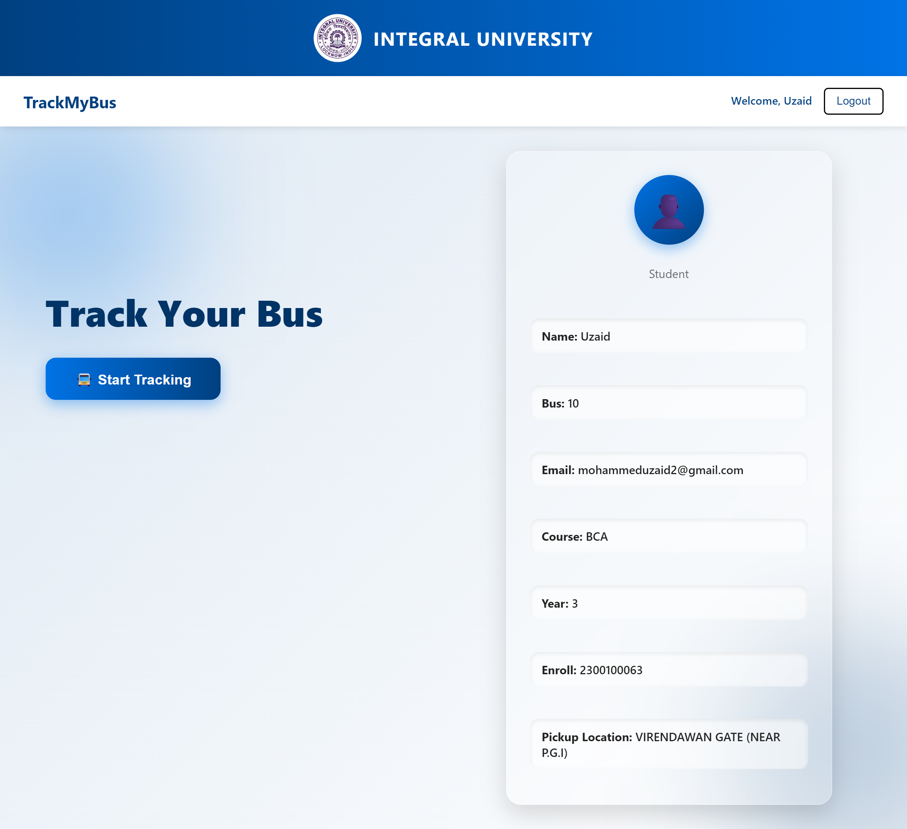
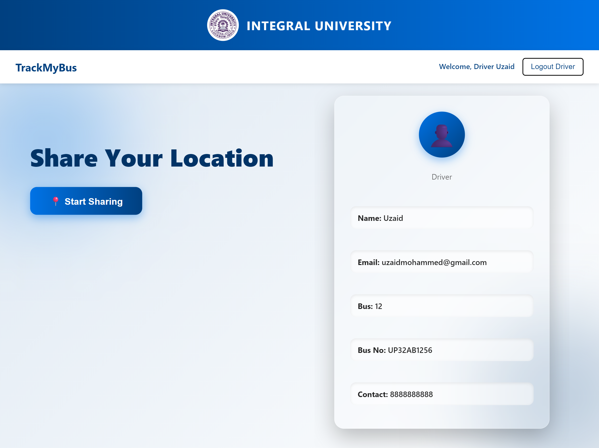
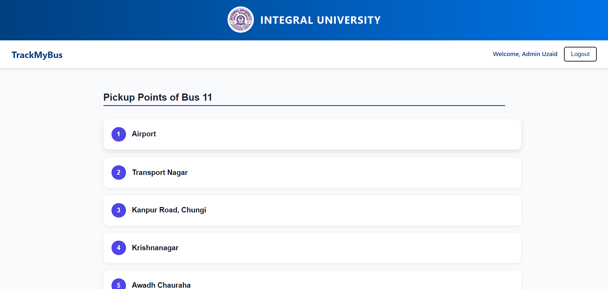
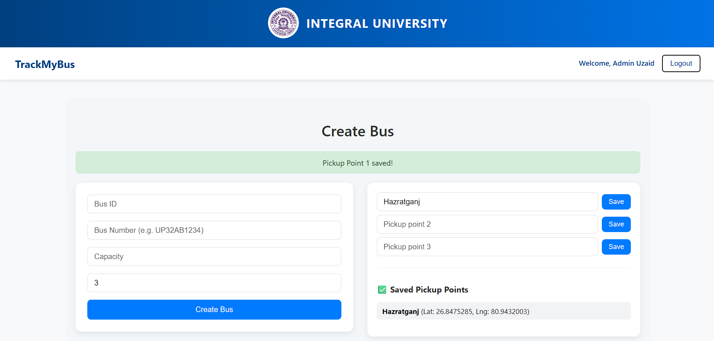
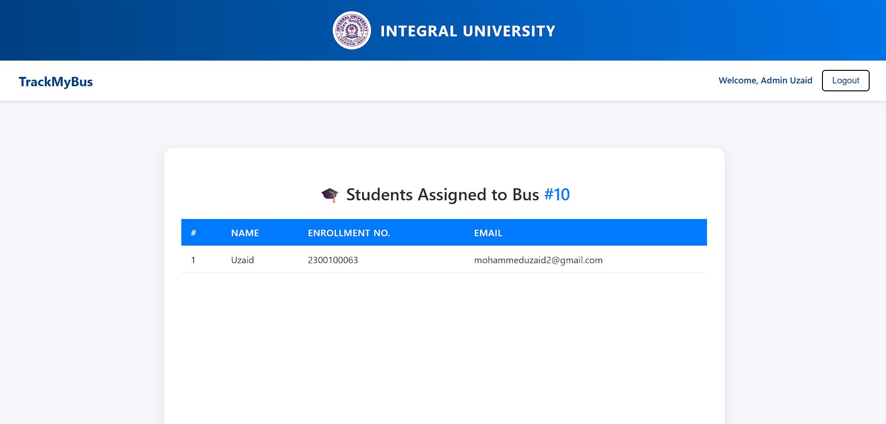

# 🚌 TrackMyBus – Real-Time University Bus Tracking System

## 🎯 Overview

**TrackMyBus** is a smart, real-time bus tracking system built especially for **Integral University** students and staff.  
It allows students to track their university buses live, while drivers share their current GPS coordinates using the **browser’s Geolocation API (`watchPosition()`)** — no external GPS hardware needed.  

The system ensures accurate arrival notifications, complete admin control, and seamless communication between students, drivers, and the administration.

---

## ⚙️ Features

### 👨‍🎓 User Features
- 🔍 **Track Your University Bus in Real-Time** — View your bus moving live on the map.  
- 📍 **Auto Location Updates** — Driver’s GPS coordinates continuously update using `watchPosition()` for real-time accuracy.  
- ⏰ **Smart Notifications**  
  1. “Your bus is arriving soon” (10 minutes away).  
  2. “Your bus has arrived” when it reaches your location.  
  *(Implemented using Firebase Cloud Messaging)*  
- 🔐 **Password Reset** — Forgot your password? Receive a reset link via **NodeMailer**.

---

### 🚍 Driver Features
- 📡 **Share Real-Time GPS Location** — Driver’s location updates continuously using `watchPosition()` and syncs to the backend for live tracking.  
- 🔐 **Secure Login & Password Reset** — Protected authentication and email-based password recovery.  

---

### 🧑‍💼 Admin Features
- 🛠️ **Manage Buses** — Create, edit, or delete bus records.  
- 👨‍✈️ **Driver Management** — Admins can register and manage drivers.  
- 🎓 **Student Assignment** — View and manage which students are assigned to each bus.  
- 📍 **Pickup Points Overview** — See all pickup points for every bus.  
- 🌍 **Geocoding Integration** — Automatically converts location names to latitude & longitude using **Nominatim API**.  
- 🛰️ **Live Tracking Dashboard** — Monitor every bus in real-time.

---

## 🧩 Tech Stack

| **Layer** | **Technologies Used** |
|:-----------|:----------------------|
| **Frontend** | React.js, Leaflet.js (for maps), CSS |
| **Backend** | Node.js, Express.js |
| **Database** | MongoDB |
| **Routing API** | OpenRouteService (ORS) API |
| **Notifications** | Firebase Cloud Messaging (FCM) |
| **Email Service** | NodeMailer |
| **APIs** | Nominatim API (for Geocoding) |
| **Authentication** | JWT (JSON Web Token) |
| **Location Tracking** | Browser Geolocation API (`watchPosition()`) |

---

## 🗺️ How It Works

1. **Driver App** → Uses `watchPosition()` to continuously send live GPS coordinates to the backend.  
2. **User App** → Fetches location data to display bus movement on the map.  
3. **Firebase Cloud Messaging** → Sends “Arriving Soon” and “Arrived” alerts.  
4. **Admin Dashboard** → Provides complete control over buses, drivers, and students.  
5. **NodeMailer** → Handles password reset links for both drivers and users.  

---

## 🧠 Key Highlights

- 🔁 Real-time synchronization between drivers and users.  
- 🚦 Accurate ETA (Estimated Time of Arrival) calculation.  
- 📬 Smart notifications for better user experience.  
- 🧭 Integrated geocoding for easy admin management.  
- 🔒 Secure authentication and password reset flow.  

---

## 🚀 Future Enhancements

- 📱 Launch a dedicated **mobile app (Android/iOS)**.  
- 🔊 Add **voice alerts** for bus arrivals.  
- 📊 Add **analytics dashboard** for admins (usage stats, route optimization, etc.).  
- 📡 Integrate **IoT GPS devices** for even higher accuracy.  

---

## 📸 Screenshots

### 🏠 Home Page  

### 🚌 Driver Home  

### 🗺️ User Map  

### 🧭 Pickup Points  

### 🧩 Admin Dashboard  

### 🆕 Create Bus  

### 👩‍🎓 View Students  

